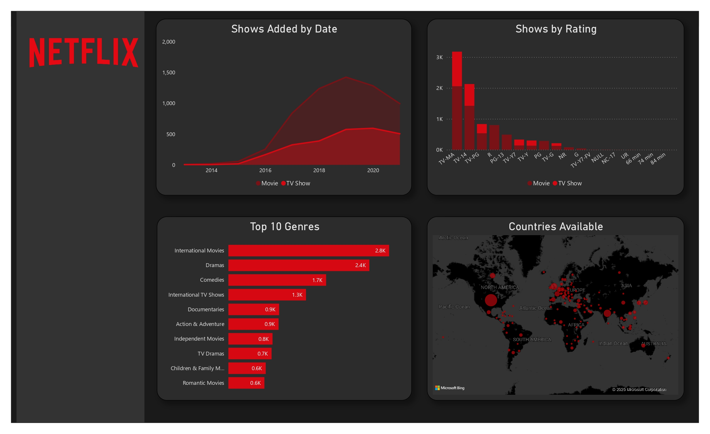

# 📊 Netflix Dashboard Analysis with Power BI

I recently completed a data visualization project focusing on **Netflix content trends**, using **Power BI** to design an interactive dashboard. The analysis provides insights into how Netflix has evolved its content library over the years, based on publicly available data.

---

## 🔍 Key Insights

### 📅 Content Growth Over Time
- Netflix's content library has steadily increased year-over-year.
- Both **Movies** and **TV Shows** show growth, with variations in trend patterns.

### ⭐ Distribution by Ratings
- Most content falls under **TV-MA** and **TV-14**, showing a strong focus on mature audiences.
- Family-friendly categories like **TV-Y**, **TV-G**, and **PG** are present but less prominent.

### 🎭 Top 10 Genres
- **International Movies**, **Dramas**, and **Comedies** dominate the platform.
- Other popular genres include **Documentaries**, **Action & Adventure**, and **TV Dramas**.

### 🌍 Global Reach
- Netflix content is distributed across a wide range of countries, reinforcing its global strategy.

---

## 💡 Project Objectives

- Visualize the growth and distribution of Netflix’s content.
- Identify audience targeting through rating and genre analysis.
- Explore Netflix's international content expansion.

---

## 🛠 Tools Used

- **Power BI Desktop**
- Data: Netflix public dataset

---

## 🚀 Next Steps

I plan to enhance this analysis by exploring:
- Viewer engagement patterns by genre or rating
- Content release frequency by country
- Correlation between release year and content popularity

---

## 🤝 Let's Connect!

If you're passionate about **data analytics**, **streaming trends**, or **visual storytelling**, feel free to reach out! I'm always excited to exchange ideas and collaborate on data-driven projects.

---

### 🔗 Tags
`#PowerBI` `#DataVisualization` `#NetflixAnalytics` `#StreamingData` `#DashboardDesign`

